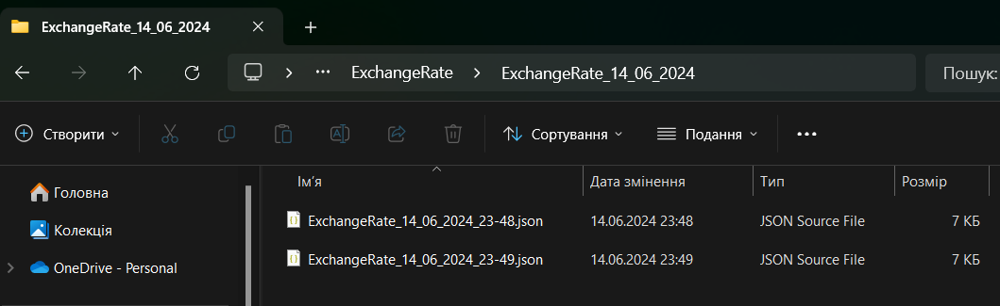
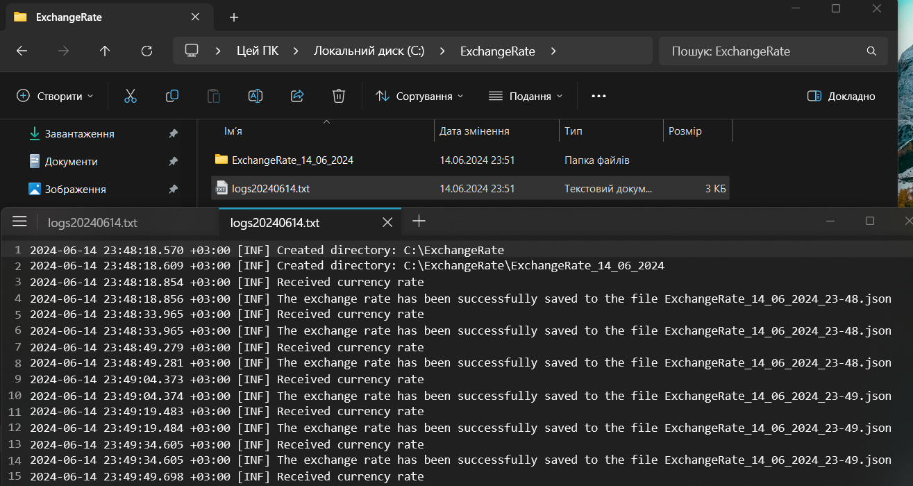
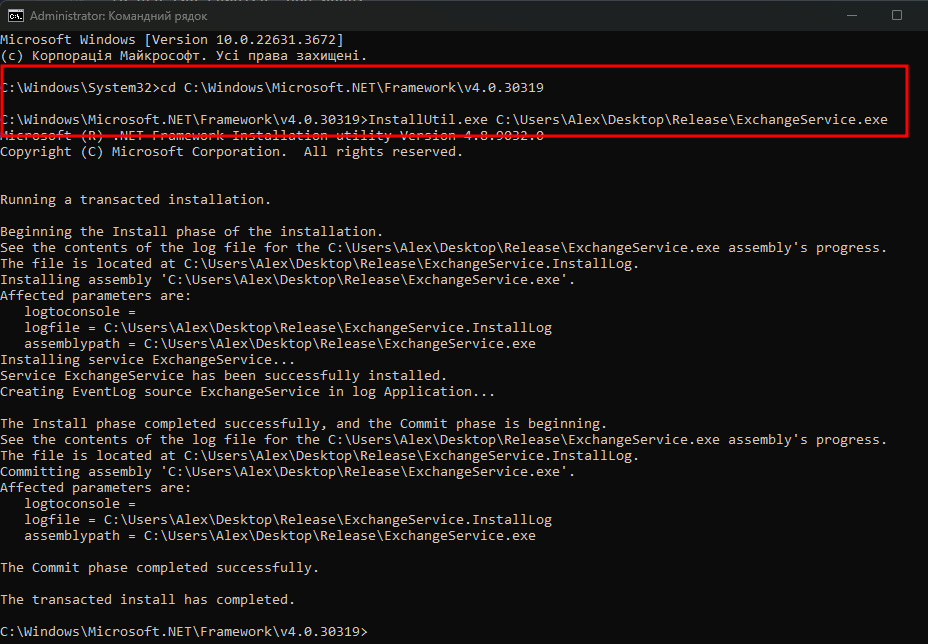
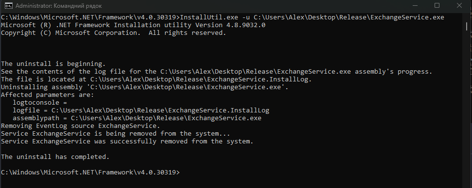
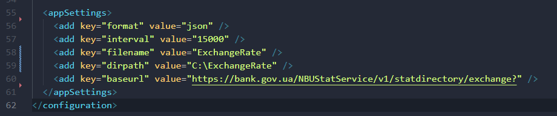
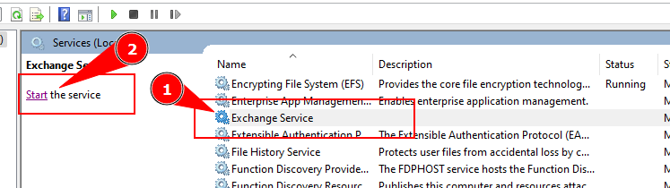

# Exchange Service

This project is a Windows service designed to get 
the exchange rate using data from the National
Bank of Ukraine (NBU) API 

## How it work`s

The service receives the exchange rate and saves it in a file with the format specified in the configuration file (json, xml, or csv). This is done at the specified interval. Files are saved to the specified directory and for each new day a new directory is created with the date of creation, and during the day all files will be saved to this directory. The files will have the names specified in the configuration file + date and time of data acquisition. When changing the day, a new directory is created and the following files will be saved to the new one.

Actions performed by the service, as well as exceptions that may occur during operation, are saved to a log file

## How to register service

To use the service, you need:

1. Download and unzip the archive

2. Run Commmand Prompt as admin
3. Navigate to "C:\Windows\Microsoft.NET\Framework\v4.0.30319"
4. Than input to cmd
   `InstallUtil.exe "<path to folder>\Release\ExchangeService.exe"`
5. Press Enter

2. Press 'Start'

## How to delete service

1. Run Commmand Prompt as admin
2. Than input to cmd
   `InstallUtil.exe -u "<path to folder>\Release\ExchangeService.exe"`
3. Press Enter

## Configure Service

Open `ExchangeService.exe.config` file and change parameters on `AppSettings` tag

## How to start service

1. Open Services and find nessesary one

